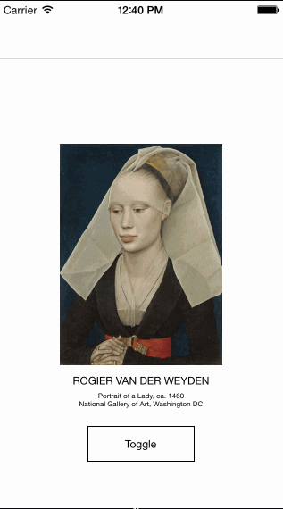

# ARASCIISwizzle

[](https://travis-ci.org/dblock/ARASCIISwizzle)
[](http://cocoadocs.org/docsets/ARASCIISwizzle)
[](http://cocoadocs.org/docsets/ARASCIISwizzle)

## Demo



## Usage

``` objc
#import <ARASCIISwizzle/UIFont+ASCII.h>
#import <ARASCIISwizzle/UIImageView+ASCII.h>

- (void)toggle
{
    UIFont.ascii = ! UIFont.ascii;
    UIImageView.ascii = ! UIImageView.ascii;
}
```

## Installation

ARASCIISwizzle is available through [CocoaPods](http://cocoapods.org), to install it simply add the following line to your Podfile:

    pod "ARASCIISwizzle"

## Testing

Try it out with CocoaPods also,

    pod try "ARASCIISwizzle"

## Credits

* [Creating ASCII Art from UIImage](http://weakreference.wordpress.com/2010/11/17/ios-creating-an-ascii-art-from-uiimage)
* [How to Draw a String](http://stackoverflow.com/questions/2765537/how-do-i-use-the-nsstring-draw-functionality-to-create-a-uiimage-from-text)
* [Creating Thumbnails from UIImage](https://gist.github.com/djbriane/160791)

## Copyright & License

ARASCIISwizzle is (c) [Artsy Inc.](http://artsy.net), available under the MIT license.

See the [LICENSE](LICENSE) file for more information.

