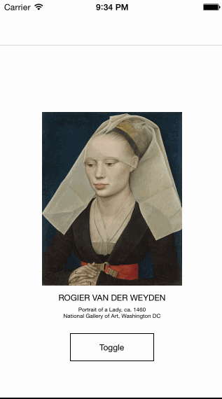

# ARASCIISwizzle

[](https://travis-ci.org/dblock/ARASCIISwizzle)
[](http://cocoadocs.org/docsets/ARASCIISwizzle)
[](http://cocoadocs.org/docsets/ARASCIISwizzle)

ASCII-art all the things. Transforms all UIImageView's into ASCII art and replaces all fonts with Courier.
Built for the [Artsy.net](http://artsy.net) March 2014 Hackathon.
Combine with [DRKonamiCode](https://github.com/objectiveSee/DRKonamiCode) and you're in business!

## Demo



[Portrait of a Lady, Rogier Van Der Weyden](https://artsy.net/artwork/rogier-van-der-weyden-portrait-of-a-lady-1), courtesy of the National Gallery of Art, Washington D.C., via Artsy.net

## Usage

### Replace All Images and Fonts

``` objc
#import <ARASCIISwizzle/UIFont+ASCII.h>
#import <ARASCIISwizzle/UIImageView+ASCII.h>

- (void)toggle
{
    UIFont.ascii = ! UIFont.ascii;
    UIImageView.ascii = ! UIImageView.ascii;
}
```

### ASCII Art API

See [UIImage+ASCII.h](Classes/UIImage+ASCII.h).

``` objc
#import <ARASCIISwizzle/UIImage+ASCII.h>

UIImage *image = ...

// ASCII NSString representation of the image
NSString *asciiText = image.asciiText;

// ASCII UIImage representation of the image
UIFont *font = [UIFont fontWithName:@"Courier New" size:12.0];
UIColor *color = [UIColor yellowColor];
UIImage *asciiImage = [image asciiImage:font color:color];
```

### Combine with Konami Code

Toggle swizzling with *Up Up Down Down Left Right Left Right B A* gestures. See [this gist](https://gist.github.com/dblock/9732650).

## Installation

ARASCIISwizzle is available through [CocoaPods](http://cocoapods.org), to install it simply add the following line to your Podfile:

    pod "ARASCIISwizzle"

## Testing

Try it out with CocoaPods also,

    pod try "ARASCIISwizzle"

## Credits

* [Creating ASCII Art from UIImage](http://weakreference.wordpress.com/2010/11/17/ios-creating-an-ascii-art-from-uiimage)
* [Creating a UIImage from Text](http://stackoverflow.com/questions/2765537/how-do-i-use-the-nsstring-draw-functionality-to-create-a-uiimage-from-text)
* [Resizing a UIImage](http://stackoverflow.com/questions/7645454/resize-uiimage-by-keeping-aspect-ratio-and-width)

## Copyright & License

ARASCIISwizzle is (c) [Artsy Inc.](http://artsy.net), available under the MIT license.

See the [LICENSE](LICENSE) file for more information.

